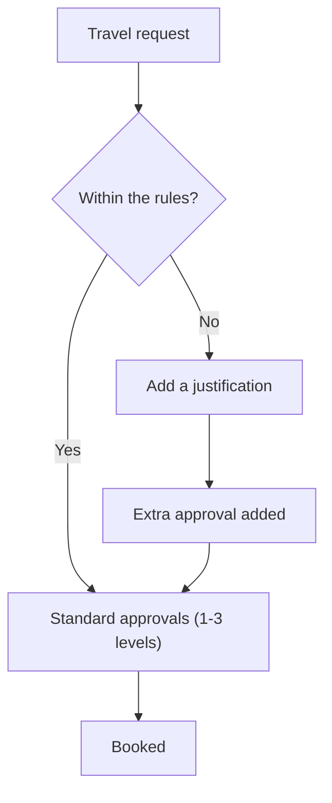
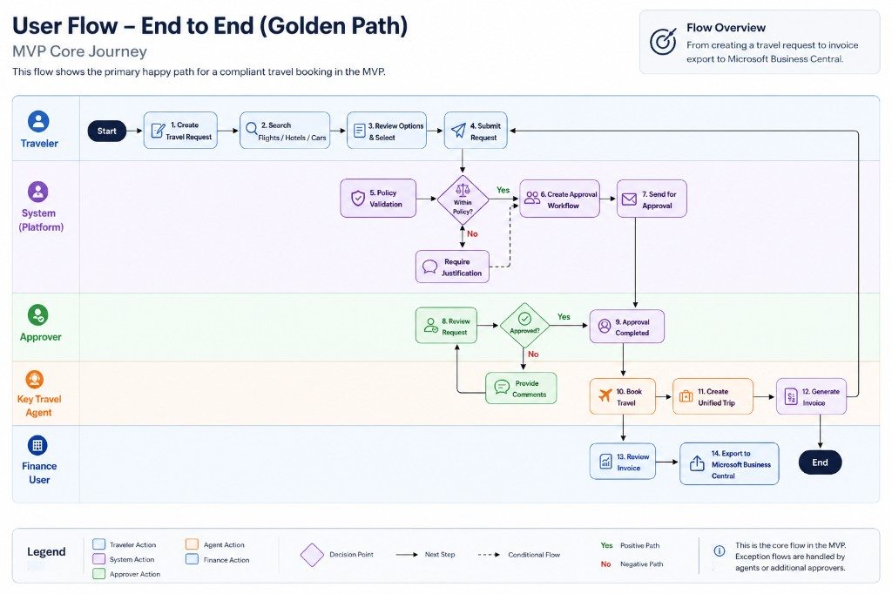
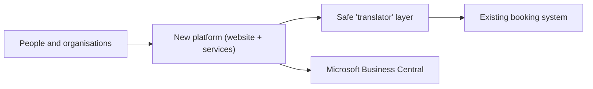
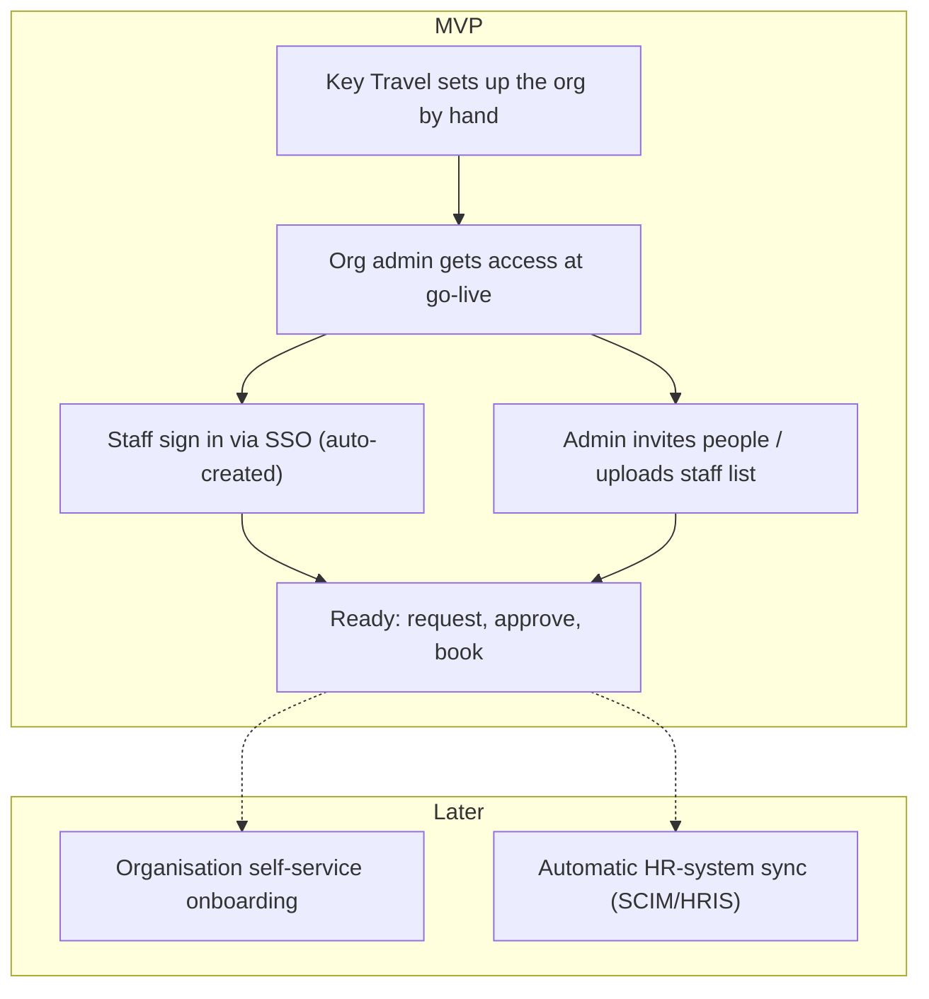

# Solution Vision — Key Travel B2B Platform

**A self-service travel platform for Key Travel's organisational clients** — staff book their own travel within their organisation's rules, requests are approved automatically along the way, and Key Travel's existing booking system does the heavy lifting behind the scenes.

## The problem
- Booking today is **internal and agent-only** — clients phone or email, and Key Travel agents do everything by hand.
- **Approvals and invoicing are manual** → slow, error-prone, and hard to scale.
- **Multi-stage trips** (e.g. flight + rail + hotel) are booked across separate systems, with **no single "trip" view** — as the client noted, agents lack a joint "trip" concept today.

## Vision
> One self-service platform where client organisations manage their people, travel rules and end-to-end trips — with the right approvals applied automatically and Key Travel's booking system behind the scenes — so travel is booked **faster, within the rules, and with far less manual effort** on both sides.

## Principles
- **Reuse, don't rebuild** — build on Key Travel's existing booking system.
- **Start small, ship fast** — deliver the core end-to-end flow first, then add breadth.
- **Set up, don't re-program** — organisations, rules and approvals are settings, not custom code.
- **Safe and private by design** — secure login (SSO/MFA), data privacy (GDPR) and an activity log from day one.

## Who it's for
| Role | In a nutshell |
|---|---|
| Traveller | Requests a trip that follows the rules; tracks its status |
| Travel Arranger | Books on behalf of colleagues — typically **someone from the travel department** (or the traveller themselves), not a line manager |
| Approver (levels 1–3) | Approves requests, with the policy context in front of them — usually a **budget-owning manager** |
| Organisation Administrator | Manages their own people (add/remove staff, set roles) |
| Finance | Handles one central invoice; sends figures to Microsoft Business Central |
| Key Travel Agent | Sets up and supports client organisations; handles exceptions |

## The core journey (MVP)
**Request → check against the rules → 1–3 approvals → book → central invoice.** Travel that breaks a rule is still allowed **with a justification** (a gentle nudge, not a hard block) and simply gets an extra approval.

How approvals adapt to the rules — in-policy trips take the standard path; out-of-policy trips need a justification and pick up one extra approval:

The end-to-end golden path in detail — showing each role's actions, the policy check, the justification branch for out-of-policy travel, and invoice export to Microsoft Business Central:

## How it fits together (in plain terms)
- A **web app** (fully usable on desktop; mobile/tablet-optimized layouts are a fast-follow) backed by behind-the-scenes services for people, rules, trips and money; a **native mobile app (iOS/Android) comes later**.
- A safe **"translator" layer** reuses Key Travel's existing booking APIs — booking, changes and cancellations (search-via-API to confirm) — instead of rebuilding them; **invoicing is handled by the new platform** (no invoicing API) and sent to **Microsoft Business Central**.
- **Biggest unknown:** the existing system's connections and documentation are incomplete → we investigate this first, in the discovery week, before finalising the plan.

## Getting organisations & people started
- For the pilot, organisations are set up **by hand by Key Travel** (single sign-on (SSO), a starter staff list, and — where useful — a welcome email at go-live). This is a **manual/internal step, not a built onboarding product**; a self-service onboarding flow comes later.
- The **organisation's administrator manages their own people**; the travel rules, approvals, budgets and system connections are set up by Key Travel in the MVP.

Onboarding at a glance — solid boxes are in the MVP; the dashed items come later:

## How we'll measure success
**North-star:** more travel booked **self-service, within the rules, with far less agent effort.**

- **Leading indicators** (the platform directly moves these; our pilot evidence): self-service completion rate ↑ · agent-hours per booking ↓ · request-to-confirmation time ↓ · booking errors ↓ · request→booking conversion ↑.
- **Lagging outcomes** (business goals, longer horizon): **higher client satisfaction** — a quick post-booking rating (CSAT/effort score) plus periodic NPS and pilot interviews · **revenue growth** — lower cost-to-serve enabling scale, more booking value captured in-channel, and more active organisations.

*We capture a **"before" baseline in discovery** so every metric is measured as a delta. **Success-metric events are instrumented from the MVP; charts and dashboards come later.***
