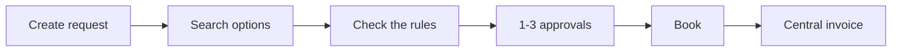
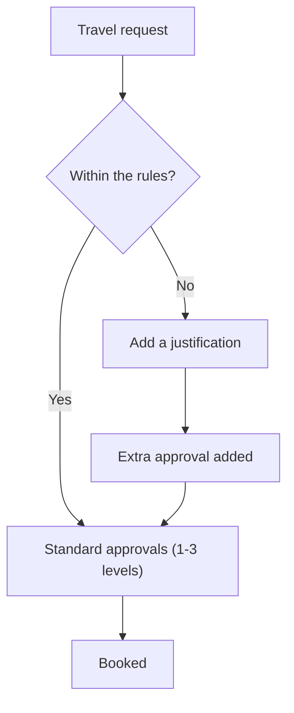
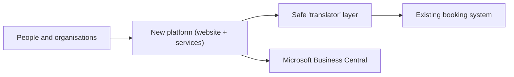

# Key Travel — A self-service platform for organisational travel

Presale & Discovery Proposal · Trinetix — Presale Consultant

From a manual, agent-only process to a platform where client organisations request their own travel — checked against their rules and sent through the right approvals — with Key Travel's booking system behind the scenes.

---

## Context & what we heard

**Today:** booking is internal and agent-only (clients phone or email); approvals and invoicing are done by hand; there's no single view of a multi-part trip; growth just means more agent hours per booking.

**From the clarification call:**
- **#1 need:** a complete **self-service request → approval flow**, connected to the booking system.
- The goal is **efficiency and growth**, not selling software.
- Approvals: **1–3 configurable levels** (cost, destination, seniority, cabin class).
- Reuse the existing booking **APIs** (search / book / change / cancel); **no invoicing API** → Microsoft Business Central.
- Six roles + a Key Travel Agent · staff book for others · pilot first · SSO/MFA login & data privacy · **launch fast**.

**Constraints:** ~9-month MVP · limited budget · little client tech capacity.

---

## Vision & principles

> One self-service platform where client organisations manage their people, travel rules and end-to-end trips — with the right approvals applied automatically and Key Travel's booking system behind the scenes — so travel is booked **faster, within the rules, and with far less manual effort**.

- **Reuse, don't rebuild** — build on the existing booking system.
- **Start small, ship fast** — deliver the core flow first, then add more.
- **Set up, don't re-code** — organisations, rules and approvals are settings, not custom code.
- **Safe and private by design** — secure login (SSO/MFA), data privacy (GDPR) and an activity log from day one.

---

## Who it's for

- **Traveller** — requests a trip that follows the rules; tracks its status.
- **Travel Arranger** — books on behalf of colleagues.
- **Approver (levels 1–3)** — approves requests, with the rule context in front of them.
- **Organisation Administrator** — manages their own people (add/remove staff, set roles).
- **Finance User** — handles one central invoice; sends figures to Microsoft Business Central.
- **Key Travel Agent** — sets up and supports organisations; handles exceptions (deeper act-on-behalf comes later).

---

## The core journey (MVP)

**Request → check the rules → approval → book → invoice**

1. **Create request** — who, where, when, why.
2. **Search options** — flights/hotels/cars via the existing booking system.
3. **Check the rules** — cost, destination, department, seniority, cabin class.
4. **Approvals (1–3)** — configurable; an extra step if a rule is broken.
5. **Book** — through the existing system; an agent handles exceptions.
6. **Invoice** — one central invoice → Microsoft Business Central.

Travel that breaks a rule is **allowed with a justification** (a nudge, not a block) and gets an extra approval.

> **Add the visual:** insert the *User Flow — End-to-End (Golden Path)* image — `assets/user_flow_golden_path.png` — on this slide. It shows each role's actions across the flow, the policy check, the justification branch, and invoice export to Business Central.

---

## MVP vs. later

Within the MVP we prioritise **Must / Should / Could** — only the **Musts** are essential to the pilot; Should/Could are added if time allows.

**MVP — Must (the core spine):** organisations, people & roles; book on behalf of others · Key Travel-assisted onboarding + secure login (SSO/MFA) + welcome emails · the travel request form + one unified trip · the travel rules + "warn and justify" · 1–3 levels of approval · the link to the existing booking system + agent hand-off · central invoicing + company card + Business Central · data privacy + activity log · **a web app (fully usable on desktop)**.

**MVP — Should/Could (if time allows):** automated welcome/activation email · mobile/tablet-optimized layouts · accounts auto-created on first login · bulk staff upload · notifications · change/cancel a booking · cost-centre tagging · success-metric (KPI) tracking.

**Later:** Key Travel Agent act-on-behalf across organisations · organisations onboarding & configuring themselves · automatic sync with an HR system · a tool to preview/test approval chains · reporting dashboards & charts · connecting directly to airlines/hotels · traveller safety tracking (duty-of-care) · automatic train & bus booking · individuals paying themselves · a native mobile app (iOS/Android).

---

## Rough 9-month timeline

| Stage | When | Focus |
|-------|------|-------|
| **Discovery** | Week 1 | A 1-week working sprint to agree the plan; start investigating the booking-system link (continues afterwards) |
| **Stage 1** | Mo 1–4 | Request → Approve: organisations, onboarding, rules, approvals, SSO/MFA login |
| **Stage 2** | Mo 4–8 | Approve → Book → Invoice + Business Central |
| **Final polish** | Mo 8–9 | Security, data-location setup, client testing, pilot go-live |

Time and budget are fixed, so **scope is what flexes** — we ship the "must-haves" first and move the rest later, with regular demos.

---

## How it fits together

- A **web app** (fully usable on desktop; mobile/tablet-optimized layouts a fast-follow) plus behind-the-scenes services for people, rules, trips and money; a **native mobile app (iOS/Android) comes later**.
- A safe **"translator" layer** reuses the existing booking APIs (search / book / change / cancel) and shields the new platform from the old system's quirks.
- The **new platform creates invoices** (there's no automatic link) and sends the figures to **Microsoft Business Central**.
- **Secure login (SSO/MFA)**; each organisation kept separate; an activity log; **GDPR + PCI DSS** card handling.

> **Biggest unknown:** the existing system's connections and documentation are incomplete → we investigate this first, in the discovery week, before finalising the plan.

---

## Getting organisations & people started

- **Organisations — set up by hand:** for the pilot, Key Travel sets up each organisation **manually** (structure, rules, login, Business Central) — not a built onboarding product; a welcome email at go-live is a nice-to-have. *(A self-service onboarding flow comes later.)*
- **Staff — nothing for client IT to do:** accounts are **created automatically on first login** via single sign-on (SSO), and admins can **invite people** or **upload a staff list**. *(Automatic HR-system sync comes later.)*
- **Who manages what:** the organisation's admin manages **their own people**; the rules, approvals, budgets and system connections are **set up by Key Travel** at first. Key Travel provides **assisted support** during the pilot; deeper act-on-behalf and org self-service are **post-MVP**.

---

## Bonus — a working prototype

- **Role-based** workspace · **live rules** (spending limits, restricted destinations, cabin class, senior-leader oversight) · **approval chains that differ per organisation** · the full journey + finance · clear **"MVP / later" labels** (each role opens on its own to-do list; charts and the chain-preview tool are labelled *later*).
- **Demo:** flight to Nairobi (within the rules) → change to Khartoum £2,100 (restricted + over budget → justification, the approval chain grows) → approve → book → central invoice → Business Central.

*A live web app, deployed online.*

---

## In summary

**Ship the core, prove it with a pilot, scale with confidence.**

- **Focused MVP** — self-service request → approval → booking → central invoicing.
- **De-risked early** — investigate the booking link first, state our assumptions, keep scope flexible.
- **Tangible today** — a working, role-based prototype ready to demo.

**Next step:** a focused **1-week discovery week** — starting the booking-system investigation and agreeing scope, rules & technical approach — then straight into building. Success = more self-service, less agent time, faster confirmations, fewer errors, higher client satisfaction, revenue growth.

---

## Appendix · Assumptions & discovery

**Confirm first:** how the existing booking system really works (what it covers, its documentation, the invoicing gap) · who sets up the rules (Key Travel or the organisations) · where data must be stored (UK/EU) · agreement that scope is the flexible part · the onboarding & Key Travel support model.

**Discovery (1-week sprint):** Day 1 goals, people & roles, onboarding · Day 2 today's process, the "trip" idea, the rules · Day 3 the booking-system link + payments/invoicing · Day 4 security, privacy & look-and-feel · Day 5 final scope + technical plan. The booking-system deep-dive starts Day 3 and continues into the first build stage; smaller details are settled as we go.

---

## Appendix · Diagram source (Mermaid)

Gamma doesn't render Mermaid from pasted text — paste these into **[mermaid.live](https://mermaid.live)** to export a PNG, or recreate them with Gamma's **Smart Diagrams** (`/diagram`).

> **Preferred visual:** for the core journey + approvals, use the ready-made **User Flow — Golden Path** image (`assets/user_flow_golden_path.png`) instead of the first two Mermaid snippets below. Keep "How it fits together" as a Smart Diagram.

**The core journey**

**How approvals work**

**How it fits together**

